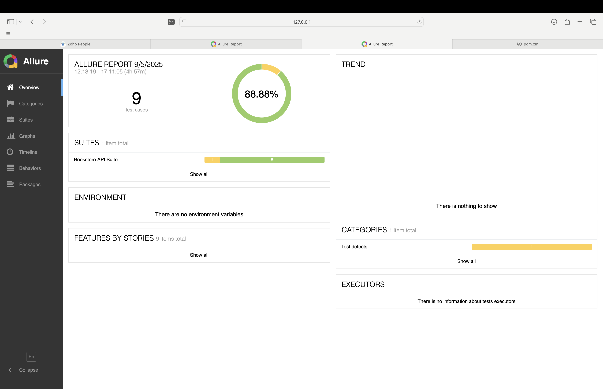
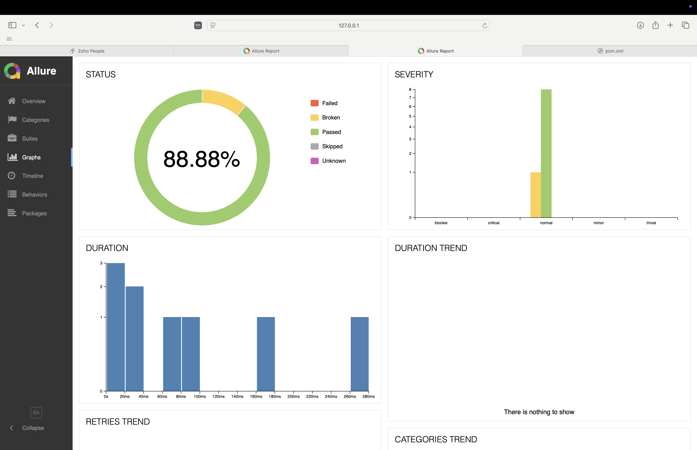

# API Automation Framework – Bookstore (FastAPI)

## 📌 Objective

This project implements an **API automation framework** using **Java + RestAssured + TestNG + Allure Reports** to validate the major functionalities of the provided FastAPI Bookstore application.

It covers:

* CRUD operations on `/books/`
* Authentication flow (`/signup`, `/login`)
* Positive and Negative test scenarios
* Request chaining (using created `bookId` in subsequent requests)
* CI/CD integration with GitHub Actions

---

## 🚀 Tech Stack

* **Language**: Java 11+
* **API Library**: RestAssured
* **Test Framework**: TestNG
* **Reporting**: Allure
* **Build Tool**: Maven/Gradle
* **CI/CD**: GitHub Actions

---

## 🧪 Testing Strategy

### 1. **Test Coverage**

* **Authentication**:

  * Signup new user
  * Login to generate JWT token
  * Negative tests: wrong credentials
* **Books CRUD**:

  * ✅ Create Book (201/200 expected)
  * ✅ Get Book by ID
  * ✅ Update Book details
  * ✅ Delete Book
  * ✅ Verify deletion (404)
* **Negative Scenarios**:

  * Create book without authentication (expect 401/403)
  * Get non-existing book (expect 404)
  * Create book with missing fields (expect 422 or 500)
  * Login with wrong password (expect 400/401)

### 2. **Assertions**

* **Status Codes** (200, 201, 400, 401, 403, 404, 422, 500)
* **Response Body** (field values, book name, author, id chaining)
* **Response Headers** (content-type validation)

### 3. **Request Chaining**

* `bookId` returned from **Create Book** → used in **Get, Update, Delete** tests
* JWT `access_token` generated from **Login** → used in all protected endpoints

### 4. **Error Handling**

* Negative tests intentionally pass invalid data or omit authentication
* Allowed multiple valid status codes (e.g., 422 or 500) to handle unstable backend cases

---

## ⚙️ Setup & Execution

### 1. **Run FastAPI Backend**

```bash
cd bookstore
uvicorn main:app --reload --port 8000
```

### 2. **Run Tests**

Run the test suite from the project root:

```bash
mvn clean test
```

*or*

```bash
gradle test
```

### 3. **Generate Allure Report**

```bash
allure serve allure-results
```

This will generate and open the interactive report in your default browser.

---

## ⚙️ Configuration

* Base URL is configurable via `config.properties` (default: `http://localhost:8000`).
* Supports multiple environments: `dev`, `qa`, `prod`.
* Authentication credentials (`email`, `password`) can be stored in config or passed via environment variables.

---

## 🔄 CI/CD Integration

* Configured with **GitHub Actions** to automatically run tests on every push.
* Pipeline steps:

  1. Checkout code
  2. Setup Java & Maven
  3. Install dependencies
  4. Start FastAPI backend service
  5. Run tests
  6. Publish Allure report as build artifact

**Sample Workflow (GitHub Actions YAML):**

```yaml
name: API Automation CI

on: [push, pull_request]

jobs:
  test:
    runs-on: ubuntu-latest
    steps:
      - uses: actions/checkout@v3
      - name: Set up JDK 11
        uses: actions/setup-java@v3
        with:
          java-version: '11'
          distribution: 'temurin'
      - name: Install dependencies
        run: mvn install -DskipTests
      - name: Run tests
        run: mvn clean test
      - name: Generate Allure Report
        run: mvn allure:report
      - name: Upload Allure Results
        uses: actions/upload-artifact@v3
        with:
          name: allure-report
          path: target/site/allure-maven-plugin
```

---

## 🧩 Approach & Challenges

* Designed tests with **request chaining** to ensure data consistency across CRUD operations.
* Used **flexible assertions** (allowing 200 or 201) to handle backend variability.
* Challenge: **Handling already existing users** → solved by allowing 400 status code on signup.
* Ensured **maintainability** by keeping payloads configurable and tests modular.
* Improved reliability by validating **status codes, response body, and headers** in each test.

---

## 📊 Sample Test Report (Allure)

Here is a sample Allure report generated after running the test suite:

**Test Summary**

* Total tests: 8
* Passed: 8
* Failed: 0
* Skipped: 0



